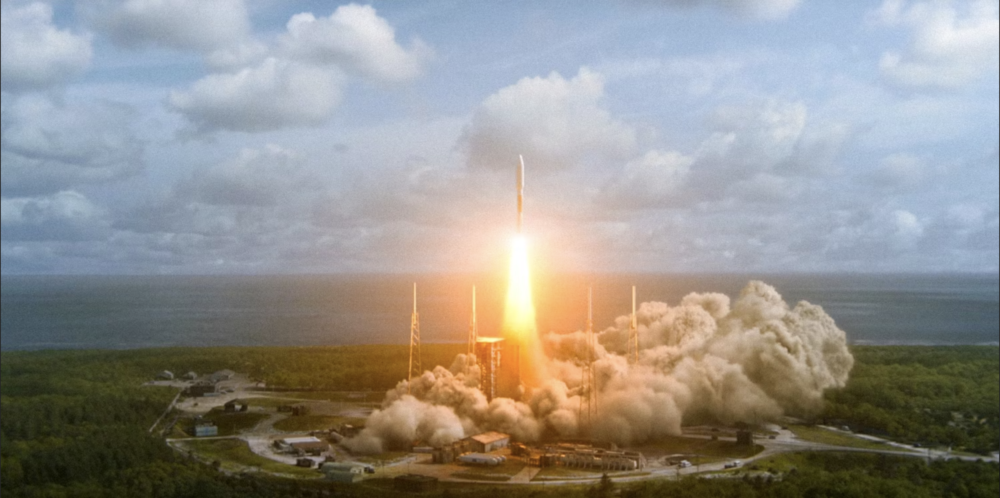
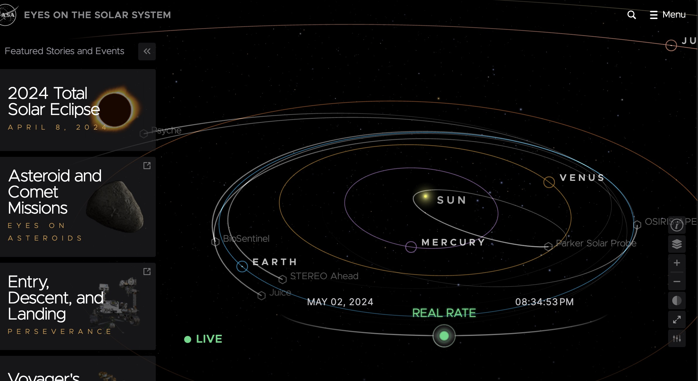

# QUIZ 8 

## Part 1 
The design is inspired by the last episode of the Netflix series "The Three-Body Problem."  The episode has a scene that launches a rocket from Earth to outer space. I am going to animate the sophisticated process by code incorporating user interactions, video, and sounds.
The series features high-quality visual effects and intricate designs that vividly bring a complex sci-fi world to life on the Web which aligns with our course content.  I aim to draw from these visual elements in my creative coding project, using programmatically generated graphics and animations to enhance the immersive and interactive experience of my artwork.

## Part2 Technique Exploration 
I decided to use the three.js framework to implement my **3-D rocket launching and interstellar travelling animation** for the following reasons:
- Three.js is a Javascript framework/library that aligns with our course content, easy to work with
- Three.js has an open-source well-support library, practical to apply
- Highly interactable on the web to meet the assignment requirements
- It's specifically used for 3-D animation and perfectly meets the demands of my design for my sophisticated and dynamic design.
- As it's a JS library, I can incorporate what I learnt in the class (SVG, p5.js) into the project.

### three.js projects show three.js in various actions 
[Navigating earth and solar system by NASA, highly interactable  and sophisticated]
(https://eyes.nasa.gov/apps/solar-system/#/earth )
 
 [Rocket Launching presentation, embedded with video playing and sound]
 (https://leap-for-mankind.com/  )
 
[three.js code example for planets and solar system]
(https://github.com/KyleGough/solar-system)

